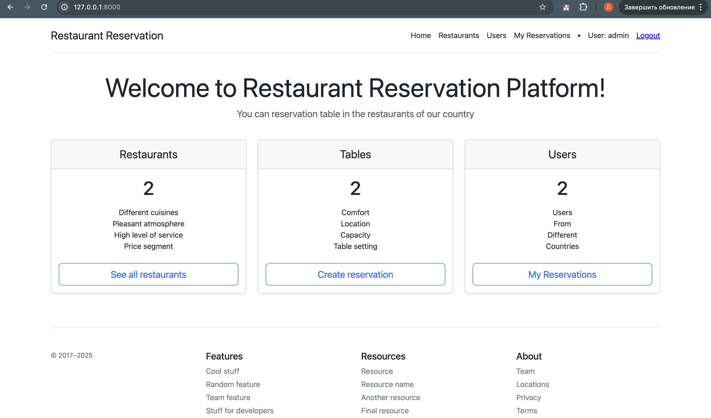

# restaurant-table-reservation

Django project for reserving tables in restaurants.

## Installation

git clone https://github.com/dimakherson74/restaurant-table-reservation.git
cd reservation
python 3 -m venv venv
source venv/bin/activate
pip install -r requirement.txt
python manage.py runserver

## Features

Authentication functionality for CustomUser.
Only admin can add, delete, and edit tables, restaurants and users.

## Demo

https://dashboard.render.com/web/srv-cv9l2tofnakc73a8g8mg/events
